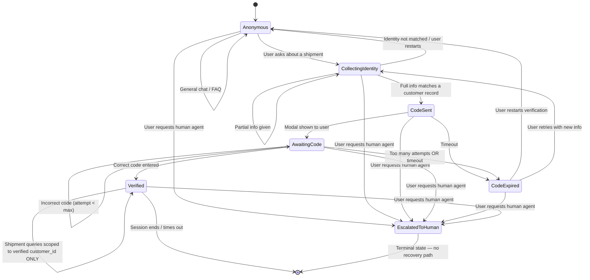

```mermaid
stateDiagram-v2
    [*] --> Anonymous

    Anonymous --> Anonymous: General chat / FAQ
    Anonymous --> CollectingIdentity: User asks about a shipment
    Anonymous --> EscalatedToHuman: User requests human agent

    CollectingIdentity --> CollectingIdentity: Partial info given
    CollectingIdentity --> Anonymous: Identity not matched / user restarts
    CollectingIdentity --> CodeSent: Full info matches a customer record
    CollectingIdentity --> EscalatedToHuman: User requests human agent

    CodeSent --> AwaitingCode: Modal shown to user
    CodeSent --> CodeExpired: Timeout
    CodeSent --> EscalatedToHuman: User requests human agent

    AwaitingCode --> Verified: Correct code entered
    AwaitingCode --> AwaitingCode: Incorrect code (attempt < max)
    AwaitingCode --> CodeExpired: Too many attempts OR timeout
    AwaitingCode --> EscalatedToHuman: User requests human agent

    CodeExpired --> Anonymous: User restarts verification
    CodeExpired --> CollectingIdentity: User retries with new info
    CodeExpired --> EscalatedToHuman: User requests human agent

    Verified --> Verified: Shipment queries scoped to verified customer_id ONLY
    Verified --> EscalatedToHuman: User requests human agent
    Verified --> [*]: Session ends / times out

    EscalatedToHuman --> [*]: Terminal state — no recovery path
```
