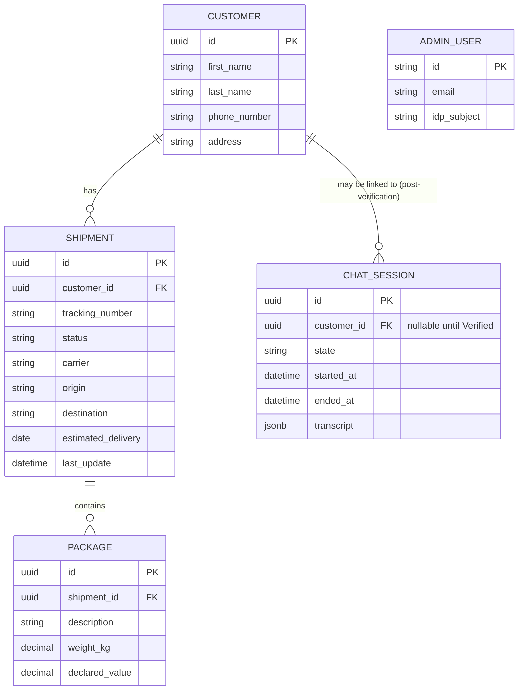

### 6.4 Data model (ERD)

```mermaid
erDiagram
    CUSTOMER ||--o{ SHIPMENT : has
    SHIPMENT ||--o{ PACKAGE : contains
    CUSTOMER ||--o{ CHAT_SESSION : "may be linked to (post-verification)"
    CUSTOMER {
        uuid id PK
        string first_name
        string last_name
        string phone_number
        string address
    }
    SHIPMENT {
        uuid id PK
        uuid customer_id FK
        string tracking_number
        string status
        string carrier
        string origin
        string destination
        date estimated_delivery
        datetime last_update
    }
    PACKAGE {
        uuid id PK
        uuid shipment_id FK
        string description
        decimal weight_kg
        decimal declared_value
    }
    CHAT_SESSION {
        uuid id PK
        uuid customer_id FK "nullable until Verified"
        string state
        datetime started_at
        datetime ended_at
        jsonb transcript
    }
    ADMIN_USER {
        string id PK
        string email
        string idp_subject
    }
```
