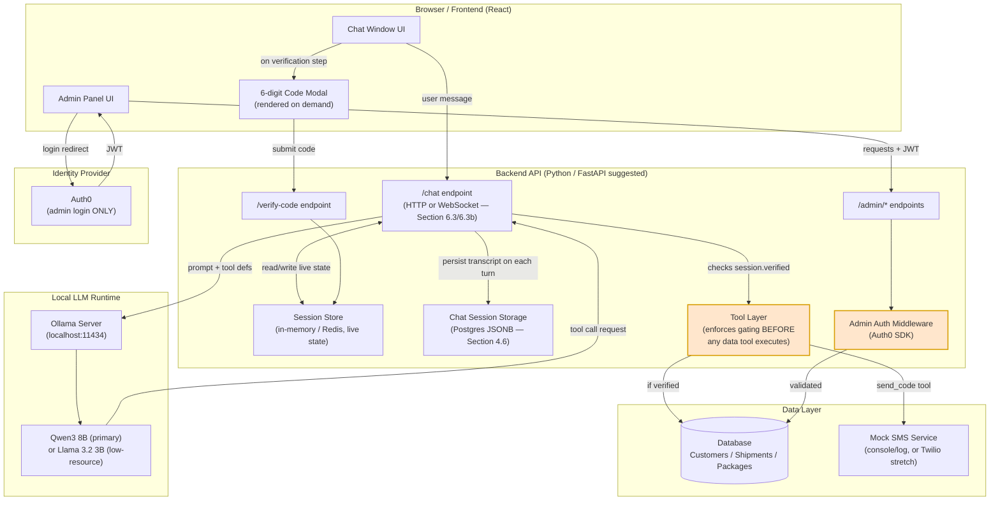

```mermaid
flowchart TB
    subgraph Client["Browser / Frontend (React)"]
        UI[Chat Window UI]
        Modal["6-digit Code Modal<br/>(rendered on demand)"]
        AdminUI[Admin Panel UI]
    end

    subgraph Backend["Backend API (Python / FastAPI suggested)"]
        ChatAPI["/chat endpoint<br/>(HTTP or WebSocket — Section 6.3/6.3b)"]
        VerifyAPI["/verify-code endpoint"]
        AdminAPI["/admin/* endpoints"]
        SessionStore["Session Store<br/>(in-memory / Redis, live state)"]
        ChatDB["Chat Session Storage<br/>(Postgres JSONB — Section 4.6)"]
        ToolLayer["Tool Layer<br/>(enforces gating BEFORE<br/>any data tool executes)"]
        AuthMW["Admin Auth Middleware<br/>(Auth0 SDK)"]
    end

    subgraph LocalLLM["Local LLM Runtime"]
        Ollama["Ollama Server<br/>(localhost:11434)"]
        Model["Qwen3 8B (primary)<br/>or Llama 3.2 3B (low-resource)"]
    end

    subgraph DataLayer["Data Layer"]
        DB[("Database<br/>Customers / Shipments / Packages")]
        SMSMock["Mock SMS Service<br/>(console/log, or Twilio stretch)"]
    end

    subgraph IdP["Identity Provider"]
        Auth0["Auth0<br/>(admin login ONLY)"]
    end

    UI -->|"user message"| ChatAPI
    ChatAPI -->|"prompt + tool defs"| Ollama
    Ollama --> Model
    Model -->|"tool call request"| ChatAPI
    ChatAPI -->|"checks session.verified"| ToolLayer
    ToolLayer -->|"if verified"| DB
    ToolLayer -->|"send_code tool"| SMSMock
    ChatAPI <-->|"read/write live state"| SessionStore
    ChatAPI -->|"persist transcript on each turn"| ChatDB
    UI -->|"on verification step"| Modal
    Modal -->|"submit code"| VerifyAPI
    VerifyAPI --> SessionStore

    AdminUI -->|"login redirect"| Auth0
    Auth0 -->|"JWT"| AdminUI

    AdminUI -->|"requests + JWT"| AdminAPI
    AdminAPI --> AuthMW
    AuthMW -->|"validated"| DB

    style ToolLayer fill:#ffe6cc,stroke:#d79b00,stroke-width:2px
    style AuthMW fill:#ffe6cc,stroke:#d79b00,stroke-width:2px
```
