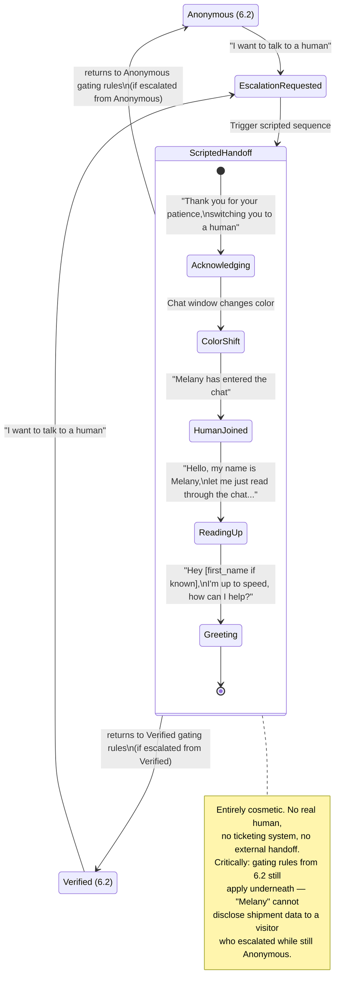

```mermaid
stateDiagram-v2
    state "Anonymous (6.2)" as Anon
    state "Verified (6.2)" as Ver

    Anon --> EscalationRequested: "I want to talk to a human"
    Ver --> EscalationRequested: "I want to talk to a human"

    EscalationRequested --> ScriptedHandoff: Trigger scripted sequence

    state ScriptedHandoff {
        [*] --> Acknowledging: "Thank you for your patience,\nswitching you to a human"
        Acknowledging --> ColorShift: Chat window changes color
        ColorShift --> HumanJoined: "Melany has entered the chat"
        HumanJoined --> ReadingUp: "Hello, my name is Melany,\nlet me just read through the chat..."
        ReadingUp --> Greeting: "Hey [first_name if known],\nI'm up to speed, how can I help?"
        Greeting --> [*]
    }

    ScriptedHandoff --> Anon: returns to Anonymous gating rules\n(if escalated from Anonymous)
    ScriptedHandoff --> Ver: returns to Verified gating rules\n(if escalated from Verified)

    note right of ScriptedHandoff
        Entirely cosmetic. No real human,
        no ticketing system, no external handoff.
        Critically: gating rules from 6.2 still
        apply underneath — "Melany" cannot
        disclose shipment data to a visitor
        who escalated while still Anonymous.
    end note
```
