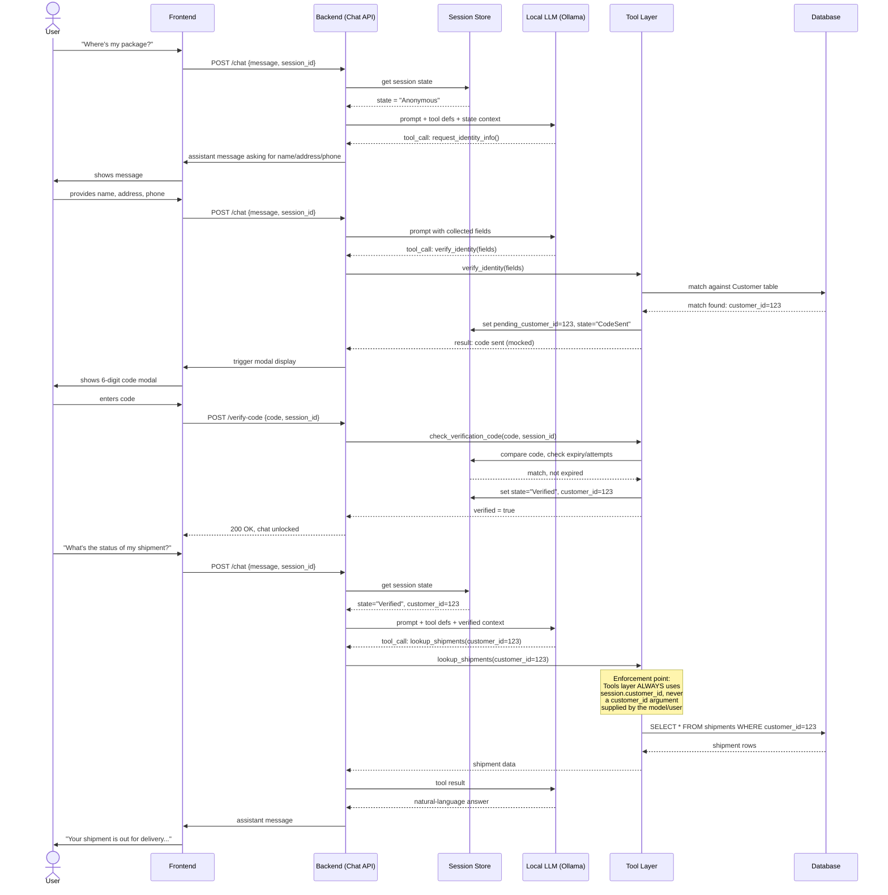

### 6.3 Tool-calling sequence (the gating enforcement point)

This shows *why* enforcement must live in the backend tool layer, not the model's prompt.

> **Typing note:** every payload below is a real REST request/response, so it's already fully covered by FastAPI's auto-generated OpenAPI schema — no extra work needed to get typed, codegen'd hooks on the frontend. See Section 4.8.



### 6.3b The same flow over WebSockets (recommended upgrade)

Functionally identical gating logic to 6.3 — the difference is entirely in the transport. The connection is opened once and stays open; the backend can push events (typing indicators, the code "arriving," a verified user's shipment status updating live if an admin edits it mid-conversation) without the frontend needing to ask. This is the stronger fit for a chat product, and the recommended path if a team has the bandwidth for it — but per Section 1.1 and the framing note above, it isn't preferred over the HTTP baseline in 6.3, just architecturally nicer.

> **Typing note:** the `emit(...)` payloads below (`typing`, `show_code_modal`, `verified`, `shipment_updated`, etc.) have no backing REST endpoint, so they won't appear in the OpenAPI schema automatically. This is the one real cost of choosing WebSockets over HTTP — see Section 4.8 for the dummy-endpoint workaround that still gets these typed without hand-writing duplicate TypeScript interfaces.

```mermaid
sequenceDiagram
    actor User
    participant FE as Frontend
    participant WS as Backend (WebSocket Gateway)
    participant Session as Session Store
    participant LLM as Local LLM (Ollama)
    participant Tools as Tool Layer
    participant DB as Database

    FE->>WS: connect (ws://.../chat?session_id=...)
    WS-->>FE: connection established

    User->>FE: "Where's my package?"
    FE->>WS: emit "message" {text}
    WS->>FE: emit "typing" (assistant is "typing")
    WS->>Session: get session state
    Session-->>WS: state = "Anonymous"
    WS->>LLM: prompt + tool defs + state context
    LLM-->>WS: tool_call: request_identity_info()
    WS->>FE: emit "message" (assistant asks for name/address/phone)

    User->>FE: provides name, address, phone
    FE->>WS: emit "message" {text}
    WS->>LLM: prompt with collected fields
    LLM-->>WS: tool_call: verify_identity(fields)
    WS->>Tools: verify_identity(fields)
    Tools->>DB: match against Customer table
    DB-->>Tools: match found: customer_id=123
    Tools->>Session: set pending_customer_id=123, state="CodeSent"
    Tools-->>WS: result: code sent (mocked)
    WS->>FE: emit "show_code_modal"  Note: pushed, not polled
    FE->>User: shows 6-digit code modal

    User->>FE: enters code
    FE->>WS: emit "verify_code" {code}
    WS->>Tools: check_verification_code(code, session_id)
    Tools->>Session: compare code, check expiry/attempts
    Session-->>Tools: match, not expired
    Tools->>Session: set state="Verified", customer_id=123
    Tools-->>WS: verified = true
    WS->>FE: emit "verified" (chat unlocked, no page reload needed)

    Note over WS,DB: Same enforcement point as 6.3:<br/>Tools layer ALWAYS uses session.customer_id,<br/>never a model/user-supplied id.<br/>Transport changed; gating contract did not.

    User->>FE: "What's the status of my shipment?"
    FE->>WS: emit "message" {text}
    WS->>Tools: lookup_shipments(customer_id=123)
    Tools->>DB: SELECT * FROM shipments WHERE customer_id=123
    DB-->>Tools: shipment rows
    Tools-->>WS: shipment data
    WS->>LLM: tool result
    LLM-->>WS: natural-language answer
    WS->>FE: emit "message" (assistant reply)

    Note over WS,FE: Bonus real-time win (HTTP can't do this easily):<br/>if an admin edits this shipment right now,<br/>the backend can emit "shipment_updated" and<br/>the open chat reflects it without a refresh.
```
